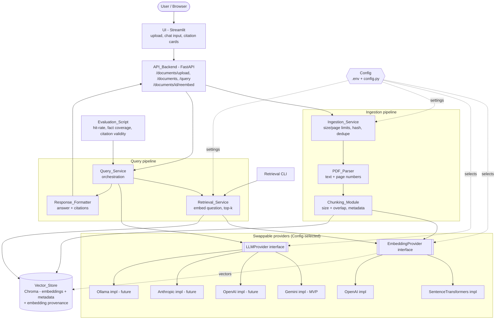

# Design Document

## Overview

The AI Document Intelligence Platform is a retrieval-augmented generation (RAG) system that ingests PDF documents, indexes their content as vector embeddings, and answers natural-language questions with answers grounded strictly in the retrieved source material. Every answer carries mandatory citations back to the source document, page, and a supporting excerpt.

This design translates the 20 approved requirements into a concrete, buildable architecture. It is deliberately pragmatic: the brief warns against premature abstraction, so abstraction is introduced only where it earns its place — specifically at the two provider boundaries (embedding and LLM) that Requirement 15 mandates be swappable through configuration. Everything else uses concrete, well-known libraries.

The design is organized around six delivery phases (environment, ingestion/retrieval, RAG generation, API/UI, evaluation, deployment) and keeps all components domain-agnostic (no banking-specific logic anywhere in the code path).

### Key design goals

1. **Grounded answers with mandatory citations** — the LLM answers only from retrieved context; every citation is derived from a chunk that was actually placed in the prompt (R8, R9).
2. **Provider modularity** — embedding and LLM providers are selected via `Config` and satisfy stable interfaces, with no source changes required to switch (R15).
3. **Embedding-space safety** — indexed documents record which provider/model embedded them; retrieval against an incompatible embedding space is blocked until re-embedding (R15.6-7, R5.5).
4. **Measurable quality** — retrieval and answer quality are evaluated against a fixed Eval_Set with three distinct metrics (R14).
5. **Free-tier deployability** — the whole system runs within the memory and rate limits of a free hosting tier, with documented fallbacks (R19).

### Open technology decisions (recommendations pending user approval)

The brief (Section 8) and Requirement 20.4 require that every open technology choice be resolved with a documented comparison across six criteria: **learning value, portfolio value, implementation complexity, free-tier cost, deployment compatibility, and future scalability**. Each decision below is a **recommendation the user can override**. No implementation begins until these are approved.

#### Decision 1 — Vector Store: Chroma (local) vs PostgreSQL + pgvector

| Criterion | Chroma (local, persistent) | PostgreSQL + pgvector |
|---|---|---|
| Learning value | Moderate — teaches vector-store concepts without SQL overhead | High — teaches production-grade vector search in a relational DB |
| Portfolio value | Moderate — common in tutorials | High — closer to what enterprises run |
| Implementation complexity | Low — `pip install`, embedded, no server | Higher — needs a Postgres instance, extension, schema, connection mgmt |
| Free-tier cost | Free — runs in-process, persists to local disk | Free tiers exist (Supabase, Neon) but add an external dependency and network hop |
| Deployment compatibility | Excellent — a directory on the container's filesystem | Requires a managed DB reachable from the free host; more moving parts |
| Future scalability | Limited — single-node, not built for large concurrent load | Strong — scales with Postgres, supports SQL filtering + ANN indexes |

**Recommendation: Chroma (local, persistent client).** For an MVP that must stand up quickly on a memory-constrained free tier with 3-5 documents, Chroma removes an entire class of infrastructure. The provider-style seam around the `Vector_Store` (see Architecture) means pgvector remains a clean future upgrade, which we record in `DECISIONS.md` as the documented scalability path. *Recommendation — user may override in favor of pgvector for stronger portfolio signal.*

#### Decision 2 — Embedding provider/model: OpenAI `text-embedding-3-small` vs local `sentence-transformers`

| Criterion | OpenAI `text-embedding-3-small` (1536-dim) | Local `sentence-transformers` (`all-MiniLM-L6-v2`, 384-dim / `bge-small-en-v1.5`, 384-dim) |
|---|---|---|
| Learning value | Moderate — API integration, tokenization, cost | High — model loading, local inference, tradeoffs |
| Portfolio value | Moderate — shows API RAG | High — shows cost-free, offline-capable RAG |
| Implementation complexity | Low — one HTTP call per batch | Moderate — model download (~90MB MiniLM), first-load latency |
| Free-tier cost | Paid per token (small, but non-zero; needs a key + billing) | **Free** — no API cost, no key |
| Deployment compatibility | Fine, but adds a paid dependency and rate limits | Runs in-process; model weights add ~90-130MB RAM — fits typical free tiers |
| Future scalability | Strong — managed, high-quality embeddings | Adequate — batch throughput bound by CPU on free tier |

**Recommendation: local `sentence-transformers` with `all-MiniLM-L6-v2` (384-dim) as the default, with OpenAI `text-embedding-3-small` available behind the same interface.** This keeps the demo free to run and offline-capable, avoids embedding rate limits during ingestion, and demonstrates local-model engineering. `bge-small-en-v1.5` is a drop-in higher-quality alternative if evaluation shows weak retrieval. *Recommendation — user may override to OpenAI for higher retrieval quality if a key/budget is available.*

**Free-tier conflict flagged (R19.3):** local embeddings consume host RAM (~90-130MB for the model plus working memory). On a 512MB free tier this is acceptable alongside the app but leaves little headroom. Documented fallback: switch the embedding provider to OpenAI via `Config` (moves memory off-box in exchange for API cost/rate limits) — one config change, no code change.

#### Decision 3 — LLM provider: OpenAI GPT-4o-mini vs Anthropic Claude vs local via Ollama (behind a provider interface)

| Criterion | OpenAI GPT-4o-mini | Anthropic Claude (Haiku-class) | Local via Ollama (e.g. Llama 3.1 8B) |
|---|---|---|---|
| Learning value | Moderate | Moderate | High — local serving, quantization |
| Portfolio value | High — widely recognized | High — widely recognized | High — self-hosted LLM |
| Implementation complexity | Low | Low | High — Ollama runtime + model pull |
| Free-tier cost | Low paid (very cheap per token) + free trial credits | Low paid + trial credits | **Free** but needs substantial RAM/CPU (8B model ≈ 5-8GB) |
| Deployment compatibility | Excellent on any free host | Excellent | **Poor on free tiers** — model size exceeds 512MB-1GB memory limits |
| Future scalability | Strong | Strong | Bound by local hardware |

**Recommendation: OpenAI GPT-4o-mini as the default LLM provider, with an Anthropic Claude implementation and an Ollama implementation both available behind the `LLMProvider` interface.** GPT-4o-mini is inexpensive, high quality for grounded extraction, and deploys anywhere. Ollama is retained as an interface implementation for local development but is **not viable on a free hosting tier** due to memory. *Recommendation — user may override to Claude, or use Ollama for fully-local dev.*

**Zero-budget MVP note (selected default: Google Gemini free tier).** For this project's strict ₹0 budget, the selected default LLM for the MVP is **Google Gemini free tier (`gemini-flash-latest`)** rather than GPT-4o-mini, because it is free-tier-compatible and deployable on the free host at zero cost while still providing high-quality grounded extraction. Gemini is added as a concrete `GeminiLLMProvider` behind the existing `LLMProvider` interface. OpenAI GPT-4o-mini, Anthropic Claude, and Ollama are **retained behind the same interface as future options** — the comparison above stands unchanged and simply describes the paid/local alternatives that the interface keeps available. This zero-cost selection is recorded in `DECISIONS.md`.

**Free-tier conflict flagged (R19.3):** a local LLM (Ollama, 8B model) cannot run on a 512MB-1GB free host. Documented resolution: default to a hosted, free-tier LLM (Google Gemini `gemini-flash-latest`) for the deployed demo, which keeps it at zero cost; GPT-4o-mini/Claude remain selectable hosted alternatives and Ollama remains selectable via `Config` for local runs only.

#### Decision 4 — UI framework: Streamlit vs Gradio

| Criterion | Streamlit | Gradio |
|---|---|---|
| Learning value | High — general-purpose Python app framework | Moderate — ML-demo oriented |
| Portfolio value | High — widely used for data/AI apps | High — native to HuggingFace Spaces |
| Implementation complexity | Low — `st.file_uploader`, `st.chat_input`, `st.expander` map directly to our needs | Low — `gr.File`, `gr.Chatbot`, `gr.Accordion` |
| Free-tier cost | Free (Streamlit Community Cloud, or self-hosted) | Free (first-class on HF Spaces) |
| Deployment compatibility | Runs anywhere; native on Streamlit Cloud | **Native on HuggingFace Spaces** (one-click) |
| Future scalability | Good for demos; not a production frontend | Good for demos; not a production frontend |

**Recommendation: Streamlit.** Its `file_uploader`, `chat_input`, and `expander` primitives map cleanly to the required upload control, chat-style input, and expandable citation cards (R13). It reads as a general engineering tool rather than an ML-demo-only tool, which is a slightly stronger portfolio signal. *Recommendation — user may override to Gradio, which pairs most naturally with HuggingFace Spaces hosting (see Decision 5).*

#### Decision 5 — Hosting: HuggingFace Spaces vs Render vs Railway (free tiers)

| Criterion | HuggingFace Spaces | Render (free web service) | Railway (trial/credits) |
|---|---|---|---|
| Learning value | Moderate — Spaces conventions | High — general PaaS, Docker | High — general PaaS, Docker |
| Portfolio value | High in ML circles | High — recognizable PaaS | High — recognizable PaaS |
| Implementation complexity | Low — git push, native Gradio/Streamlit support | Moderate — Docker + service config | Moderate — Docker + service config |
| Free-tier cost | Free (CPU Basic: ~2 vCPU, 16GB on some tiers; varies) | Free tier (512MB RAM, spins down when idle) | Usage-based credits (can exhaust) |
| Deployment compatibility | Excellent for Streamlit/Gradio; Docker supported | Excellent Docker support; live URL | Excellent Docker support; live URL |
| Future scalability | Limited to Spaces model | Paid tiers scale | Paid tiers scale |

**Recommendation: HuggingFace Spaces.** It offers the most generous free CPU/RAM allotment (important because we default to a local embedding model that needs memory), native support for Streamlit/Gradio apps, a stable public URL, and a Docker path so the `Dockerfile` requirement (R19.1) is still exercised. *Recommendation — user may override to Render for a more "generic PaaS" portfolio story; note Render's 512MB free tier is tighter and would push us toward the OpenAI embedding fallback.*

> **Cross-decision note:** Decisions 4 and 5 interact. If the user prefers Render/Railway (generic PaaS), Streamlit is the natural UI. If the user prefers HuggingFace Spaces, either UI works but Gradio is marginally more native. The recommended pairing is **Streamlit on HuggingFace Spaces (Docker)**, which satisfies the containerization requirement while keeping the memory headroom our local embedding default needs.

### Finalized configuration defaults (deferred from Requirements to Design)

These defaults live in `Config` and are all overridable. They are chosen against the recommended stack (local MiniLM embeddings + free-tier Google Gemini LLM + HuggingFace Spaces).

| Setting | Default | Justification |
|---|---|---|
| `MAX_PDF_SIZE_MB` | **5 MB** | A **development/testing default** chosen for a zero-cost personal portfolio project, **not** a hard architectural limit. A 5MB cap keeps parse/embed peak memory small on the tightest free tiers and makes local iteration fast. It remains fully configurable via `Config` / environment variable and can be raised later (the requirement's size-limit *range/behavior* is unchanged; only the concrete default is lowered). |
| `MAX_PDF_PAGES` | **50 pages** | A **development/testing default** for the zero-cost portfolio MVP, **not** a hard architectural limit. Bounding a document to ~50 pages keeps the total chunk/embedding count small, so ingestion stays fast and memory-predictable on free CPU. It remains configurable via `Config` / environment variable and can be raised later without any redesign (the requirement's page-limit *range/behavior* is unchanged; only the concrete default is lowered). |
| `CHUNK_SIZE_TOKENS` | **700 tokens** | Mid-upper end of the required 500-800 range (R4.1). Larger chunks preserve more context per passage (better for regulatory prose) while staying within embedding model context limits. |
| `CHUNK_OVERLAP_TOKENS` | **90 tokens (≈13%)** | Within the required 10-15% of chunk size (R4.2); 90/700 ≈ 12.9%. Enough overlap to avoid splitting facts across a boundary without inflating index size. |
| `TOP_K` | **5** | Matches the Requirements default (R6.3, Top_K glossary). Five chunks give the LLM enough grounding context while keeping the prompt small and cheap. |
| `EMBEDDING_PROVIDER` | `sentence-transformers` | Recommended default (Decision 2). |
| `EMBEDDING_MODEL` | `all-MiniLM-L6-v2` | Recommended default (Decision 2). |
| `LLM_PROVIDER` | `gemini` | Recommended default (Decision 3) — Google Gemini free tier keeps the deployed demo at zero cost. |
| `LLM_MODEL` | `gemini-flash-latest` | Recommended default (Decision 3) — free-tier-compatible Gemini model. |

### MVP vs Stretch Scope

Provider modularity is itself an explicit requirement (R15), so the two provider **interfaces** (`EmbeddingProvider`, `LLMProvider`) and their **factories** are part of the MVP even though only one concrete implementation of each ships in the MVP. The interfaces earn their place in the MVP by making the recorded provenance, the embedding-space compatibility check (R15.6-7), and Config-driven selection (R15.3-4) real and testable — not by requiring every provider to be built. Additional concrete implementations plug into the existing seams later with no architectural change.

**MVP (must ship):**

- `EmbeddingProvider` and `LLMProvider` **interfaces** and their **factories** (`build_embedding_provider`, `build_llm_provider`) — provider modularity is required by R15, so the seams and Config-driven selection are MVP.
- **One** working embedding implementation: `SentenceTransformersEmbeddingProvider` (`all-MiniLM-L6-v2`).
- **One** working LLM implementation: `GeminiLLMProvider` (Google Gemini, `gemini-flash-latest`) — the zero-cost free-tier LLM for the MVP.
- PDF ingestion (`PDF_Parser`), chunking (`Chunking_Module`), Chroma storage (`Vector_Store`), retrieval (`Retrieval_Service`), grounded answers (`Query_Service`), citations (`Response_Formatter`).
- Duplicate detection (`Document_Hash`), file size / page limits (`MAX_PDF_SIZE_MB`, `MAX_PDF_PAGES`).
- The FastAPI `API_Backend`, the Streamlit `UI`.
- Evaluation metrics (`Evaluation_Script`, the three metrics), automated tests (property + unit + integration).
- `Dockerfile`, deployment to a live URL, and the documentation deliverables (`README.md`, `CASE_STUDY.md`, `DECISIONS.md`).

**Stretch (interfaces are present in the MVP; these concrete implementations are deferred):**

- `OpenAIEmbeddingProvider` (`text-embedding-3-small`) — deferred; the interface it satisfies is MVP.
- `OpenAILLMProvider` (`gpt-4o-mini`) — deferred to Stretch/Future; the interface it satisfies is MVP.
- `AnthropicLLMProvider` — deferred to Stretch/Future; the interface it satisfies is MVP.
- `OllamaLLMProvider` (local-only) — deferred to Stretch/Future; the interface it satisfies is MVP.
- Any additional provider integrations or performance/quality optimizations (e.g. `bge-small-en-v1.5`, pgvector migration, LLM-as-judge evaluation).

The rationale for making Gemini the single MVP LLM implementation: the project has a strict ₹0 budget, so the deployed demo must require no paid API/service. Google Gemini's free tier keeps the live demo at zero cost, while the `LLMProvider` interface and its factory remain the architectural boundary — `OpenAILLMProvider`, `AnthropicLLMProvider`, and `OllamaLLMProvider` all plug into the same seam later with no redesign. This is recorded in `DECISIONS.md`.

The classification is recorded in `DECISIONS.md` so reviewers can see why the interfaces are MVP while the extra implementations are Stretch.

## Architecture

The system is a single FastAPI backend fronted by a Streamlit UI. The backend orchestrates two pipelines — an **ingestion pipeline** (upload → parse → chunk → embed → store) and a **query pipeline** (question → embed → retrieve → prompt → LLM → format citations). Two provider interfaces (`EmbeddingProvider`, `LLMProvider`) and a `Vector_Store` wrapper are the only abstraction seams. A standalone `Evaluation_Script` and a retrieval CLI exercise the same services outside the API.

### Component / data-flow diagram



### Component responsibilities

| Component | Responsibility | Key requirements |
|---|---|---|
| `UI` (Streamlit) | Upload control, chat-style question input, answer + expandable citation cards, error display. Stateless per query (no conversation memory). | R13 |
| `API_Backend` (FastAPI) | HTTP endpoints; request validation; error-to-HTTP mapping. | R10, R11, R12 |
| `Ingestion_Service` | Enforce size/page limits, compute `Document_Hash`, detect duplicates, assign a stable `document_id` (UUID) to each new non-duplicate document, orchestrate parse→chunk→embed→store, record embedding provenance. | R3.3, R5.3, R11 |
| `PDF_Parser` | Extract per-page text; mark empty pages; reject invalid PDFs. | R3 |
| `Chunking_Module` | Split text into overlapping token-sized chunks with metadata. | R4 |
| `EmbeddingProvider` (interface + impls) | Convert text → vector; expose provider/model identity. | R5.1, R5.4, R15.1, R15.3 |
| `Vector_Store` (Chroma wrapper) | Persist embeddings + chunk metadata + provenance keyed by `document_id`; similarity search; list documents; document-scoped chunk load/replace by `document_id`; hash-based dedupe support. | R5.2, R6.2, R6.5, R12 |
| `Retrieval_Service` | Embed question, return top-k chunks with metadata; embedding-space compatibility check. | R6, R15.6-7 |
| `LLMProvider` (interface + impls) | Generate answer from grounded prompt; report failures. | R8.5, R15.2, R15.4 |
| `Query_Service` | Orchestrate retrieve→prompt→LLM→citation assembly; handle no-answer and empty-question cases. | R8, R9 |
| `Response_Formatter` | Build `{answer, citations[]}`; derive citations only from in-context chunks. | R9 |
| `Evaluation_Script` | Run Eval_Set; compute the three metrics; write `eval/results.md`. | R14 |
| `Config` | Select providers/models and all tunables from `.env` + config file; report missing credentials by name. | R5.4, R6.3, R8.5, R11.4, R16.4 |

### Request flows

**Ingestion (`POST /documents/upload`):**
1. Receive file bytes. Enforce `MAX_PDF_SIZE_MB` → reject oversized before parsing (R11.4-5).
2. Compute `Document_Hash` (SHA-256 of file bytes). If it matches an ingested document → return "already ingested" (referencing the **existing** document's `document_id`) and stop; no chunks written and **no new `document_id` is created** (R11.6-8).
3. Parse with `PDF_Parser`. If invalid PDF → reject with reason; previously ingested docs unaffected (R3.3, R16.2).
4. Enforce `MAX_PDF_PAGES` (known after parse if not derivable earlier) → reject if exceeded, write nothing (R11.5).
5. Chunk each page's text with metadata (R4).
6. Embed each chunk via the active `EmbeddingProvider` (R5.1). On embedding failure → report, identify document, preserve prior data (R5.3, R16.3).
7. Generate a fresh `document_id` (a UUID, string form) for this new, non-duplicate document, and persist embeddings + metadata + provenance (`document_id`, `Embedding_Provider`, `Embedding_Model`, `Document_Hash`) in `Vector_Store` (R5.2, R5.5). Every stored chunk carries the owning `document_id` so chunks are addressable by it later.
8. Return success identifying the document by its `document_id` (R11.2).

**Query (`POST /query`):**
1. Validate question non-empty → else error, LLM not invoked (R10.3, R16.1).
2. Compatibility check: if any target document's recorded provider/model ≠ active provider/model, block retrieval against it and signal re-embedding required (R15.6-7).
3. Embed question via active `EmbeddingProvider`; retrieve top-k chunks (R6). Empty store → empty result (R6.5).
4. Build grounded prompt with retrieved chunks (R8.1-2).
5. Invoke `LLMProvider`. Failure → error "answer generation failed"; prior data preserved (R10.4, R16.3).
6. If context does not support an answer → `No_Answer_Response`, empty citations (R8.4, R9.3).
7. Else assemble citations, each derived from an in-context chunk (R9.1-2, R9.4).
8. Return `{answer, citations}` (R10.1-2).

## Components and Interfaces

Interfaces are Python `abc.ABC` abstract base classes (equivalently `typing.Protocol`), placed at the only two swappable seams the requirements mandate. Concrete implementations register by a string key resolved from `Config`.

### EmbeddingProvider interface (R15.1, R5.4)

```python
from abc import ABC, abstractmethod

class EmbeddingProvider(ABC):
    """Converts text into vector embeddings. Swappable via Config."""

    @property
    @abstractmethod
    def provider_name(self) -> str:
        """Stable provider identifier, e.g. 'sentence-transformers' or 'openai'."""

    @property
    @abstractmethod
    def model_name(self) -> str:
        """Stable embedding model identifier, e.g. 'all-MiniLM-L6-v2'."""

    @property
    @abstractmethod
    def dimension(self) -> int:
        """Embedding vector dimensionality."""

    @abstractmethod
    def embed_texts(self, texts: list[str]) -> list[list[float]]:
        """Embed a batch of chunk texts (ingestion). Raises EmbeddingError on failure."""

    @abstractmethod
    def embed_query(self, text: str) -> list[float]:
        """Embed a single question (retrieval). Raises EmbeddingError on failure."""
```

Concrete impls: `SentenceTransformersEmbeddingProvider` (**MVP**, default, `all-MiniLM-L6-v2`), `OpenAIEmbeddingProvider` (**Stretch**, `text-embedding-3-small`). The interface and factory are **MVP** (R15); only the SentenceTransformers implementation ships in the MVP. `provider_name` + `model_name` are what get recorded as provenance (R5.5) and drive the compatibility check (R15.6).

### LLMProvider interface (R15.2, R8.5)

```python
class LLMProvider(ABC):
    """Generates a grounded answer from a prompt. Swappable via Config."""

    @property
    @abstractmethod
    def provider_name(self) -> str: ...

    @property
    @abstractmethod
    def model_name(self) -> str: ...

    @abstractmethod
    def generate(self, prompt: str) -> str:
        """Return the model's completion for the prompt. Raises LLMError on failure."""
```

Concrete impls: `GeminiLLMProvider` (**MVP**, default, Google Gemini `gemini-flash-latest`), `OpenAILLMProvider` (**Stretch**, `gpt-4o-mini`), `AnthropicLLMProvider` (**Stretch**), `OllamaLLMProvider` (**Stretch**, local dev only). The interface and factory are **MVP** (R15); only the Gemini implementation ships in the MVP, chosen because its free tier keeps the deployed demo at zero cost while the interface/factory remain the boundary that lets the LLM be swapped later without redesign. No banking-specific logic lives in any provider (R15.5).

### Provider selection (Config-driven, R15.3-4)

```python
def build_embedding_provider(config: Config) -> EmbeddingProvider: ...
def build_llm_provider(config: Config) -> LLMProvider: ...
```

Factories map `config.embedding_provider` / `config.llm_provider` strings to the concrete class. For the LLM factory, `build_llm_provider` maps `gemini` → `GeminiLLMProvider` (the MVP default), with `openai`, `anthropic`, and `ollama` mapping to their respective Stretch implementations behind the same interface. Switching providers is a `.env` edit — no source change. If a required credential is missing, the factory raises an error naming the credential (never its value) — e.g. a missing `GEMINI_API_KEY` when `gemini` is selected raises a named, value-free error (R16.4).

### Vector_Store wrapper (R5.2, R6, R12)

A thin wrapper over Chroma so the store remains swappable to pgvector later without leaking Chroma types.

```python
class VectorStore:
    def add_chunks(                                                  # persists chunks + vectors under a document_id
        self,
        document_id: str,
        chunks: list[Chunk],
        embeddings: list[list[float]],
    ) -> None: ...
    def query(self, query_embedding: list[float], top_k: int) -> list[RetrievedChunk]: ...
    def list_documents(self) -> list[DocumentRecord]: ...
    def document_exists(self, document_hash: str) -> bool: ...       # dedupe check — keyed on SHA-256 hash (R11.6)
    def count(self) -> int: ...
```

**Keying convention (used consistently throughout):** the store persists each document's `document_id` alongside its chunk metadata and its `DocumentRecord`, so every chunk is addressable by its owning `document_id`. Document **addressing** operations (loading, replacing, re-embedding a specific document) key off `document_id`; document **dedupe** (`document_exists`) keys off `document_hash` (the SHA-256 of file bytes). These two keys are never conflated.

### PDF_Parser (R3)

Uses **PyMuPDF** (`fitz`) for reliable per-page text extraction. Returns a list of `PageText{page_number, text}`; empty pages are recorded with empty text (R3.4). Non-PDF or corrupt input raises `PDFParseError` carrying the filename and reason (R3.3).

### Chunking_Module (R4)

Token-based recursive splitter (LangChain `RecursiveCharacterTextSplitter` configured for tokens, or a small custom token splitter) with `CHUNK_SIZE_TOKENS=700`, `CHUNK_OVERLAP_TOKENS=90`. Chunks respect page boundaries so each chunk carries a single `page_number`. Produces `Chunk` objects with `{document_name, page_number, section, chunk_text}`; `section` is `None` when unavailable (R4.3-4).

**Design tradeoff — page-boundary-preserving chunking (captured in `DECISIONS.md`):** chunking deliberately does not merge text across a page break, so every chunk maps to exactly one page. This is a conscious tradeoff in favor of **citation accuracy**: because a chunk never straddles two pages, each citation can name the exact source page with no ambiguity (R9.2). The cost is a small reduction in **semantic continuity** — when a single passage spans a page break, it is split into two chunks rather than kept whole, which can slightly weaken retrieval for that passage. The `CHUNK_OVERLAP_TOKENS` setting mitigates this within a page but not across a page boundary. For a citation-first platform this tradeoff is worthwhile, and it is recorded in `DECISIONS.md`.

### Retrieval_Service (R6, R15.6-7)

Embeds the question with the active provider and calls `VectorStore.query(..., top_k)`. Before querying, it runs the **embedding-space compatibility check**: it compares each candidate document's recorded `(provider_name, model_name)` against the active provider/model and, if they differ, refuses retrieval for that document and surfaces a `ReembeddingRequiredError` identifying the affected documents (R15.6-7). Empty store → empty list (R6.5).

### Re-embedding flow (R15.7)

When the compatibility check blocks a document (its recorded `(provider_name, model_name)` differs from the active provider/model), that document must be re-embedded before the `Retrieval_Service` will include it again. This is a **simple, synchronous, on-demand operation** — deliberately **not** a background job or queue — triggered by an explicit endpoint, `POST /documents/{document_id}/reembed`, and handled inside the `Ingestion_Service` (it reuses the same embed→store path, so no new subsystem is introduced).

The flow re-uses the chunk text and metadata that are already persisted in the `Vector_Store`, so no PDF re-parse or re-upload is needed:

1. **Load stored chunks.** Read the target document's existing chunks from the `Vector_Store` (each already carries `chunk_text` plus `{document_name, page_number, section}` metadata). If no chunks exist for `document_id`, raise `DocumentNotFoundError`.
2. **Re-embed.** Embed the loaded `chunk_text` values with the **active** `EmbeddingProvider` / `Embedding_Model` via `embed_texts`.
3. **Safely swap the vectors within the document's scope.** Replace the document's stale vectors with the new ones so the document is never left half-updated or unqueryable. Two orderings are acceptable; the design uses **add-then-swap** where the store supports it: write the new embeddings under a fresh internal generation/tag for that `document_id`, then atomically point the document at the new generation and delete the stale vectors. Where the underlying store cannot stage a second generation, fall back to a **scoped delete-then-add** performed as a single logical operation confined to that one `document_id` (other documents are untouched), so a failure mid-operation affects only the document being re-embedded, never the rest of the store.
4. **Update provenance.** Set `embedding_provider` and `embedding_model` on the `DocumentRecord` and on every re-written chunk's metadata to the active provider/model (R5.5).
5. **Mark compatible.** Once provenance matches the active provider/model, the standard compatibility check (R15.6) naturally re-admits the document, so the `Retrieval_Service` includes it on the next query.

`VectorStore` gains the supporting operations used by this flow:

```python
class VectorStore:
    def get_document_chunks(self, document_id: str) -> list[Chunk]: ...   # load persisted chunk_text + metadata
    def replace_document_embeddings(                                       # scoped, all-or-nothing per document
        self,
        document_id: str,
        chunks: list[Chunk],
        embeddings: list[list[float]],
        embedding_provider: str,
        embedding_model: str,
    ) -> DocumentRecord: ...                                              # returns the same document_id with updated provenance + chunk_count
```

Both operations key off the document's stable `document_id` (never `document_hash`), so re-embedding addresses exactly the intended document. Because the operation is scoped to a single `document_id` and updates provenance only after the new vectors are in place, the document either remains on its old (blocked) embedding space or moves fully to the active one — it is never left in a partially re-embedded, unqueryable state.

### Query_Service + Response_Formatter (R8, R9)

`Query_Service.answer(question)`:
1. reject empty question (R16.1);
2. retrieve top-k;
3. if no chunks → `No_Answer_Response`, empty citations;
4. build grounded prompt (template below);
5. call `LLMProvider.generate`;
6. detect no-answer sentinel → empty citations;
7. else `Response_Formatter` builds citations, one per contributing in-context chunk, each `{document, page, excerpt}` where `excerpt` is drawn from that chunk's `chunk_text` (R9.2, R9.4).

**Grounded prompt template design (R8.1-2):**

```
You are a document question-answering assistant. Answer the user's question
using ONLY the numbered context passages below. Do not use any outside knowledge.
If the answer is not contained in the context, reply with EXACTLY:
"I don't know based on the provided documents"

Context passages:
[1] (document: {document_name}, page: {page_number}) {chunk_text}
[2] (document: {document_name}, page: {page_number}) {chunk_text}
... (one entry per retrieved chunk)

Question: {question}

Answer using only the context above. Do not fabricate citations or facts.
```

Because every context passage is tagged with its source document and page, and citations are built from the same retrieved chunk set, citation validity (R9.4) is structurally guaranteed: the formatter never invents a citation outside the retrieved set.

### API_Backend (FastAPI) (R10, R11, R12)

Thin controllers that validate input, call the services, and map domain errors to HTTP responses. Endpoints: `POST /documents/upload`, `GET /documents`, `POST /query`, and `POST /documents/{document_id}/reembed` (re-embeds a single stored document with the active provider/model; see Re-embedding flow). See API contracts below.

**`POST /documents/{document_id}/reembed` contract (R15.7):**
- **Request:** path parameter `document_id` — the target document's **stable id** (the same UUID stored on its `DocumentRecord`, as returned by upload/listing). No body; the active `EmbeddingProvider`/`Embedding_Model` come from `Config`.
- **Response:** `ReembedResponse` — `{document_id, status: 'reembedded', embedding_provider, embedding_model, chunk_count}` echoing the addressed `document_id` and reporting the updated provenance and the number of chunks re-embedded. The response `document_id` equals the path `document_id` and the `DocumentRecord.document_id`.
- **Errors:** unknown `document_id` → 404 `DOCUMENT_NOT_FOUND`; embedding provider failure → 502 `EMBEDDING_FAILED` (prior data preserved). Delegates to the `Ingestion_Service` re-embedding flow.

### Retrieval CLI (R7)

`python -m src.cli.retrieve "your question"` prints, per retrieved chunk, `document_name`, `page_number`, and `chunk_text` (R7.2). Reuses `Retrieval_Service` directly, no LLM involved.

### Evaluation_Script (R14)

Standalone script that loads the version-controlled Eval_Set, runs each question through the query pipeline, and computes three independent metrics (see Evaluation Design), writing `eval/results.md`.

## Data Models

All models are typed (Pydantic for API boundary models; dataclasses acceptable internally). Type hints and docstrings are required throughout (R17.1-2).

### Chunk (R4.3, R5.2)

```python
@dataclass
class Chunk:
    document_name: str      # source PDF filename
    page_number: int        # 1-based originating page
    section: str | None     # section identifier if available, else None (R4.4)
    chunk_text: str         # the chunk's text content
```

### Embedding provenance / DocumentRecord (R5.5, R11.6, R12, R15.6)

Stored alongside chunks in the vector store (as Chroma metadata) and summarized per document for listing and the compatibility check.

```python
@dataclass
class DocumentRecord:
    document_id: str            # stable internal identity — a UUID (string form) generated at ingestion (R11.2, R15.7)
    document_name: str
    document_hash: str          # SHA-256 of file bytes (R11.6)
    page_count: int
    chunk_count: int
    embedding_provider: str     # provenance (R5.5) e.g. 'sentence-transformers'
    embedding_model: str        # provenance (R5.5) e.g. 'all-MiniLM-L6-v2'
    ingested_at: datetime
```

**`document_id` vs `document_hash` (distinct fields, distinct jobs):**
- `document_id` — the document's **stable internal identity**: a UUID (string form) generated once when a new, non-duplicate document is first ingested. It is the handle used to *address* a document — e.g. the `document_id` path parameter of `POST /documents/{document_id}/reembed` and the document-scoped `Vector_Store` operations (`get_document_chunks(document_id)`, `replace_document_embeddings(document_id, ...)`). It is deliberately **not** equal to `document_hash`.
- `document_hash` — the **SHA-256 of the file bytes**, used **only** for duplicate detection (R11.6). It is never used to address a document for re-embedding; it only answers "have I already ingested these exact bytes?".

Each stored chunk also carries its owning `document_id` plus `embedding_provider` and `embedding_model` in its metadata, so chunks are addressable by `document_id` (for document-scoped operations) and provenance is queryable per chunk (R5.5) — the latter being what the compatibility check reads (R15.6).

### RetrievedChunk

```python
@dataclass
class RetrievedChunk:
    chunk: Chunk
    score: float                # similarity score
    embedding_provider: str     # for compatibility verification
    embedding_model: str
```

### Citation (R9.2)

```python
class Citation(BaseModel):
    document: str   # document_name of the source chunk
    page: int | str # page number, or section identifier when page is unavailable
    excerpt: str    # supporting text drawn from the in-context chunk
```

### API request/response models (R10, R11, R12)

```python
class QueryRequest(BaseModel):
    question: str
    top_k: int | None = None    # optional override; defaults to Config TOP_K

class QueryResponse(BaseModel):
    answer: str
    citations: list[Citation]   # empty when No_Answer_Response (R9.3)

class UploadResponse(BaseModel):
    document_id: str            # stable id of the ingested (or already-existing duplicate) document,
                                # so a client can later address it (e.g. for reembed) (R11.2)
    document_name: str
    status: str                 # 'ingested' | 'duplicate'
    page_count: int
    chunk_count: int
    message: str

class DocumentListResponse(BaseModel):
    documents: list[DocumentRecord]   # each carries document_id; empty list when none ingested (R12.2)

class ReembedResponse(BaseModel):
    document_id: str
    status: str                 # 'reembedded'
    embedding_provider: str     # updated provenance (active provider) (R5.5, R15.7)
    embedding_model: str        # updated provenance (active model) (R5.5, R15.7)
    chunk_count: int            # number of chunks re-embedded

class ErrorResponse(BaseModel):
    error: str                  # machine-readable code, e.g. 'EMPTY_QUESTION'
    detail: str                 # human-readable, credential-safe message
```

### Eval_Set models (R2.3, R14)

```python
@dataclass
class EvalQuestion:
    id: str
    question: str
    essential_facts: list[str]      # predefined key facts (R2.3, R14.3)
    source_document: str            # where the answer lives (R2.3)
    source_page: int
```

The Eval_Set is stored version-controlled as `eval/eval_set.json` (or YAML) (R2.4).

## Correctness Properties

*A property is a characteristic or behavior that should hold true across all valid executions of a system — essentially, a formal statement about what the system should do. Properties serve as the bridge between human-readable specifications and machine-verifiable correctness guarantees.*

The following properties were derived from the acceptance-criteria prework. Edge cases and configuration-wiring criteria (empty question, oversized/unparseable/duplicate boundaries, missing-credential reporting, provider factory mapping) are covered by example-based and edge-case unit tests in the Testing Strategy rather than as universal properties. Redundant criteria were consolidated during property reflection (e.g. returned-chunk metadata folded into the round-trip property; citation-present criteria folded into citation validity).

### Property 1: Chunk size stays within configured bounds

*For any* input document text, every chunk produced by the Chunking_Module — except possibly the final chunk — SHALL have a token count within the configured size range (500-800 tokens; default 700).

**Validates: Requirements 4.1**

### Property 2: Consecutive chunks overlap within the configured range

*For any* input document text that yields two or more chunks, each consecutive pair of chunks SHALL share a token overlap within 10-15% of the configured chunk size (default ≈13%).

**Validates: Requirements 4.2**

### Property 3: Every chunk carries complete metadata

*For any* input document, every chunk produced SHALL carry a non-empty `document_name`, a `page_number` within the document's page range, a `chunk_text` equal to the segment it represents, and a `section` field that is either a valid identifier or the defined null value.

**Validates: Requirements 4.3, 4.4**

### Property 4: Storage and retrieval preserve chunk metadata (round trip)

*For any* set of chunks with embeddings written to the Vector_Store, retrieving or listing those chunks SHALL return the same metadata `{document_name, page_number, section, chunk_text}` that was stored, unchanged.

**Validates: Requirements 5.2, 6.4**

### Property 5: Retrieval returns Top_K results ranked by similarity

*For any* Vector_Store contents and any question, the Retrieval_Service SHALL return exactly `min(Top_K, store_size)` chunks, ordered by non-increasing similarity score.

**Validates: Requirements 6.2, 6.3**

### Property 6: Embedding provenance is recorded for every indexed unit

*For any* document ingested under an active Embedding_Provider and Embedding_Model, every stored chunk and the document's record SHALL record exactly that provider and model as provenance.

**Validates: Requirements 5.5**

### Property 7: Ingestion is idempotent under identical content (duplicate detection)

*For any* document, ingesting its identical bytes a second time SHALL leave the Vector_Store in the same state as after the first ingestion (same chunk count, same document set) and SHALL report the upload as a duplicate — because the Document_Hash of identical bytes is identical.

**Validates: Requirements 11.6, 11.7, 11.8**

### Property 8: Document listing reflects exactly the ingested set

*For any* sequence of distinct documents ingested, `GET /documents` SHALL return exactly the set of ingested documents, and SHALL return an empty list when no documents have been ingested.

**Validates: Requirements 12.1, 12.2**

### Property 9: The grounded prompt contains all context and grounding instructions

*For any* non-empty set of retrieved chunks, the prompt constructed by the Query_Service SHALL contain the text of every retrieved chunk and SHALL contain the instruction to answer only from the provided context and to return the No_Answer_Response otherwise.

**Validates: Requirements 8.1, 8.2**

### Property 10: Every citation is derived from an in-context chunk

*For any* grounded answer, the returned citation list SHALL be non-empty and every Citation `{document, page, excerpt}` SHALL correspond to a chunk that was included in the context provided to the LLM_Provider; and when the answer is the No_Answer_Response, the citation list SHALL be empty.

**Validates: Requirements 9.1, 9.2, 9.3, 9.4, 10.2**

### Property 11: Retrieval is gated by embedding-space compatibility

*For any* set of indexed documents each carrying a recorded (Embedding_Provider, Embedding_Model), given an active (Embedding_Provider, Embedding_Model), the Retrieval_Service SHALL permit retrieval against exactly those documents whose recorded provider and model equal the active provider and model, and SHALL block retrieval (requiring re-embedding) for every document whose recorded provider or model differs.

**Validates: Requirements 15.6, 15.7**

**Re-embedding note (R15.7):** re-embedding is a scoped transformation that only rewrites a document's vectors and provenance to the active provider/model. It therefore composes with Property 11: after `POST /documents/{document_id}/reembed` succeeds, the document's recorded provenance equals the active provider/model, so the same compatibility check re-admits it for retrieval. Because provenance is updated only once the new vectors are in place and the operation is confined to one `document_id`, a document is never observed in a partially re-embedded state — it is either fully on its prior embedding space or fully on the active one. This behavior is covered by example/edge-case tests in the Testing Strategy (re-embed round-trip, unknown-document error) rather than as a separate universal property.

## Error Handling

Errors are handled at the boundary they occur and mapped to clear, credential-safe messages. The Platform never crashes on bad input or provider failure, and previously ingested data is always preserved across failures.

| Condition | Detection point | Behavior | HTTP mapping | Requirement |
|---|---|---|---|---|
| Empty / missing question | API validation + `Query_Service` guard | Return "a question is required"; **LLM not invoked** | 400 `EMPTY_QUESTION` | R10.3, R16.1 |
| Unparseable / invalid PDF | `PDF_Parser` raises `PDFParseError(file, reason)` | Reject; identify file + reason; prior documents still served | 400 `INVALID_PDF` | R3.3, R11.3, R16.2 |
| Oversized PDF (size limit) | `Ingestion_Service` before parse | Reject; name file + the `MAX_PDF_SIZE_MB` limit; **no chunks stored** | 413 `FILE_TOO_LARGE` | R11.4, R11.5 |
| Too many pages (page limit) | `Ingestion_Service` after parse | Reject; name file + the `MAX_PDF_PAGES` limit; **no chunks stored** | 413 `TOO_MANY_PAGES` | R11.4, R11.5 |
| Duplicate document | `Ingestion_Service` via `Document_Hash` | Return "already ingested" + existing document; no new chunks | 200 `status='duplicate'` | R11.6-8 |
| Embedding provider error | `EmbeddingProvider` raises `EmbeddingError` | Report failure, identify affected document; prior data preserved | 502 `EMBEDDING_FAILED` | R5.3, R16.3 |
| LLM provider error | `LLMProvider` raises `LLMError` | Return "answer generation failed"; prior data preserved | 502 `LLM_FAILED` | R10.4, R16.3 |
| Missing credential | Provider factory in `Config` | Raise error **naming the credential key** (e.g. `GEMINI_API_KEY` for the default Gemini provider), never its value | 500 `MISSING_CREDENTIAL` | R16.4 |
| Incompatible embedding space | `Retrieval_Service` compatibility check | Raise `ReembeddingRequiredError` listing affected documents | 409 `REEMBEDDING_REQUIRED` | R15.6-7 |
| Re-embed unknown document | `Ingestion_Service` re-embedding flow (no document/chunks for the given `document_id`) | Raise `DocumentNotFoundError` — the supplied `document_id` matches no stored document; store unchanged | 404 `DOCUMENT_NOT_FOUND` | R15.7 |
| Re-embed embedding failure | `EmbeddingProvider` during re-embed | Report failure; document stays on its prior (blocked) embedding space; not left half-updated | 502 `EMBEDDING_FAILED` | R5.3, R15.7, R16.3 |
| Empty vector store on query | `Retrieval_Service` | Empty retrieval → `No_Answer_Response`, empty citations | 200 | R6.5, R8.4 |

**Credential safety (R16.4, R17.4):** error messages and logs reference credentials by environment-variable name only. No code path serializes a secret value into a response, log line, or exception message.

## Testing Strategy

The Platform uses a **dual testing approach**: property-based tests for universal logic properties, and example/edge-case unit tests plus one integration test for concrete behaviors and boundaries.

### Why property-based testing applies here

The core logic — chunking, hashing/idempotent ingestion, top-k ranking, provenance recording, embedding-space gating, and citation validity — consists of pure or deterministic functions with universal properties over a large input space. These are strong PBT candidates. The provider integrations (actual embedding/LLM API calls) and infrastructure wiring are **not** PBT candidates and are covered by example and integration tests, using stub providers to isolate logic from network I/O and cost.

### Property-based tests (R18.1, R18.2)

Use **Hypothesis** (Python). Each property test runs a **minimum of 100 iterations** and is tagged with a comment referencing its design property.

Tag format: `# Feature: ai-document-intelligence-platform, Property {number}: {property_text}`

| Property | Test focus | Generators |
|---|---|---|
| P1 chunk size bounds | Chunking_Module | arbitrary text of varied length |
| P2 chunk overlap | Chunking_Module | text long enough for ≥2 chunks |
| P3 chunk metadata completeness | Chunking_Module | documents with/without section info |
| P4 storage round-trip | Vector_Store (stub embeddings) | chunk sets + vectors |
| P5 top-k ranking | Retrieval_Service (stub embeddings) | store contents + queries; varied k |
| P6 provenance recorded | Ingestion_Service | documents under known provider/model |
| P7 idempotent ingestion | Ingestion_Service | document bytes ingested twice |
| P8 listing reflects ingested set | Ingestion_Service + Vector_Store | sets of distinct documents |
| P9 grounded prompt content | Query_Service prompt builder | retrieved chunk sets |
| P10 citation validity | Response_Formatter | retrieved chunk sets + grounded answers |
| P11 embedding-space gating | Retrieval_Service | documents with assorted provenance vs active provider/model |

A property-based testing library is used — property testing is **not** implemented from scratch.

### Example-based and edge-case unit tests

- Chunking edge cases: empty text, single short chunk, exact-boundary lengths, section-less input (`section is None`) (R4.4).
- Parser edge cases: empty-text pages recorded and processing continues (R3.4); corrupt file raises `PDFParseError` (R3.3).
- Retrieval edge cases: empty store returns `[]` (R6.5); default k=5 and config override (R6.3).
- Query edge cases: empty/whitespace question rejected, LLM stub never called (R16.1); `No_Answer_Response` yields empty citations (R8.4, R9.3).
- Ingestion boundaries: files just over `MAX_PDF_SIZE_MB` / `MAX_PDF_PAGES` rejected with nothing stored (R11.5).
- Provider factories: each config value maps to the expected concrete provider (R5.4, R8.5, R15.3-4); missing credential raises a named, value-free error (R16.4).
- Re-embedding flow: after switching the active provider/model and calling `POST /documents/{document_id}/reembed`, the document's provenance equals the active provider/model, its chunk texts are unchanged, and the compatibility check re-admits it for retrieval (R15.7); an unknown `document_id` raises `DocumentNotFoundError` (404) with the store unchanged; an embedding failure mid-re-embed leaves the document on its prior embedding space (not half-updated) (R5.3, R16.3).
- Evaluation metrics: each metric equals a hand-computed value on fixed inputs and is bounded in [0,1] (R14.2-4).

### Integration test (R18.3)

One end-to-end test exercising the full query flow with stub providers: ingest a small fixture PDF → `POST /query` → assert a `{answer, citations}` response where every citation traces to an ingested chunk. This validates the wiring from question submission through to a cited answer.

### Test execution (R18.4)

`pytest` reports pass/fail per test. Property tests, unit tests, and the integration test all run under the same `pytest` invocation.

## Evaluation Design (R14)

The `Evaluation_Script` runs every Eval_Set question through the query pipeline and computes **three independent, MVP-appropriate metrics**. No mandatory LLM-as-judge is used; all three are lightweight and deterministic.

### Metric 1 — Retrieval_Hit_Rate (R14.2)

For each question, retrieve the top-k chunks and check whether the recorded correct source (matching `source_document` and `source_page`) appears among them. `Retrieval_Hit_Rate = (# questions with a hit) / (# questions)`. This isolates retrieval quality independent of the LLM.

### Metric 2 — Answer_Key_Fact_Coverage (R14.3)

For each question, check which of its predefined `essential_facts` appear in the generated answer (case-insensitive substring / normalized token match — a lightweight check, no LLM judge required). Per-question coverage = (facts present / total facts); aggregate = mean across questions.

**Limitation (MVP):** because this metric relies on **deterministic normalized text/token matching** rather than an LLM-as-judge, it MAY **undercount** semantically equivalent paraphrases. An answer that is factually correct but phrased differently from the recorded essential fact (a synonym, reordering, or paraphrase) may fail to match and be scored as missing, so `Answer_Key_Fact_Coverage` is a **conservative lower bound** on true correctness. This keeps evaluation cheap, deterministic, and reproducible for the MVP. Introducing an **LLM-as-judge** to score semantic equivalence is a documented **Stretch** improvement (see MVP vs Stretch Scope and `DECISIONS.md`).

### Metric 3 — Citation_Validity (R14.4)

For each answered question, verify that every returned Citation corresponds to a chunk that was included in the context passed to the LLM. This directly exercises Property 10. Per-question validity is 1 if all citations are valid (or the answer was `No_Answer_Response` with no citations), else 0; aggregate = mean.

### Results file (R14.5, R2.4)

Results are written to the version-controlled `eval/results.md` with both aggregate and per-question values:

```markdown
# Evaluation Results

Run: 2025-01-01T12:00:00Z | Embedding: sentence-transformers/all-MiniLM-L6-v2 | LLM: gemini/gemini-flash-latest | Top_K: 5

## Aggregate
| Metric | Value |
|---|---|
| Retrieval_Hit_Rate | 0.90 |
| Answer_Key_Fact_Coverage | 0.83 |
| Citation_Validity | 1.00 |

## Per-question
| ID | Hit | Fact Coverage | Citation Valid |
|---|---|---|---|
| q1 | yes | 3/3 | yes |
| ... | ... | ... | ... |
```

## Project Structure, Configuration, and Deployment

### Repository layout (R1)

```
ai-document-intelligence-platform/
├── src/
│   ├── config.py                 # Config: providers, models, limits, tunables
│   ├── ingestion/
│   │   ├── service.py            # Ingestion_Service (limits, hash, dedupe, orchestration)
│   │   ├── pdf_parser.py         # PDF_Parser (PyMuPDF)
│   │   └── chunking.py           # Chunking_Module
│   ├── embeddings/
│   │   ├── base.py               # EmbeddingProvider ABC + factory
│   │   ├── sentence_transformers_provider.py
│   │   └── openai_provider.py
│   ├── vectorstore/
│   │   └── chroma_store.py       # VectorStore wrapper
│   ├── retrieval/
│   │   └── service.py            # Retrieval_Service + compatibility check
│   ├── llm/
│   │   ├── base.py               # LLMProvider ABC + factory
│   │   ├── gemini_provider.py    # GeminiLLMProvider (MVP default)
│   │   ├── openai_provider.py
│   │   ├── anthropic_provider.py
│   │   └── ollama_provider.py
│   ├── query/
│   │   ├── service.py            # Query_Service + prompt template
│   │   └── formatter.py          # Response_Formatter (citations)
│   ├── api/
│   │   └── app.py                # FastAPI: /documents/upload, /documents, /query
│   ├── models.py                 # Pydantic + dataclass models
│   └── cli/
│       └── retrieve.py           # Retrieval CLI (R7)
├── ui/
│   └── app.py                    # Streamlit UI (R13)
├── tests/
│   ├── test_chunking.py          # property + unit
│   ├── test_retrieval.py         # property + unit
│   ├── test_ingestion.py         # idempotence, limits, provenance
│   ├── test_citations.py         # citation validity
│   └── test_query_integration.py # full-flow integration (R18.3)
├── data/                         # 3-5 domain PDFs (R2.1); gitignored for large artifacts
├── eval/
│   ├── eval_set.json             # Eval_Set (R2)
│   ├── run_eval.py               # Evaluation_Script (R14)
│   └── results.md                # results (R14.5)
├── notebooks/                    # exploration only, no production logic (R1.3)
├── Dockerfile                    # (R19.1)
├── requirements.txt              # pinned deps (R1.2)
├── .env.example                  # documents required env vars (no values)
├── .gitignore                    # excludes .env, venv, local data (R1.5, R17.3)
├── README.md                     # (R20.1)
├── CASE_STUDY.md                 # (R20.2)
└── DECISIONS.md                  # decision log (R20.3, R20.4)
```

`notebooks/` holds exploration only; production logic lives in `src/` (R1.3). Source, tests, and data occupy separate top-level directories (R1.1).

### Configuration approach (R5.4, R6.3, R8.5, R11.4, R16.4, R17.3)

`Config` loads from environment variables (via a `.env` file in development, provider-injected env vars in deployment) with a small `config.py` providing typed accessors and defaults. Selectable keys: `EMBEDDING_PROVIDER`, `EMBEDDING_MODEL`, `LLM_PROVIDER`, `LLM_MODEL`, `TOP_K`, `CHUNK_SIZE_TOKENS`, `CHUNK_OVERLAP_TOKENS`, `MAX_PDF_SIZE_MB`, `MAX_PDF_PAGES`, and per-provider credentials (`GEMINI_API_KEY` for the MVP default Gemini provider, plus `OPENAI_API_KEY`, `ANTHROPIC_API_KEY` for the Stretch providers). All credentials, including `GEMINI_API_KEY`, are loaded from environment variables / `.env` only and are never hard-coded. Provider factories read these strings to build concrete providers; switching providers requires no source change.

### Secret management (R17.3, R17.4)

Secrets are read from environment variables / `.env` only. `.env` is git-ignored; `.env.example` documents required variable **names** with no values. Missing credentials are reported by name (R16.4). No secret value is ever committed, logged, or returned in a response.

**Provider API keys (including `GEMINI_API_KEY`).** The `GEMINI_API_KEY` — and every other provider credential (`OPENAI_API_KEY`, `ANTHROPIC_API_KEY`) — is loaded **only** via environment variable / `.env`. Specifically:

- `.env` is **git-ignored** and never committed (R17.3).
- `.env.example` contains only placeholders with **no real value**, e.g. `GEMINI_API_KEY=your_key_here`.
- A real key must **never** appear in source code, committed config, tests, the `README`/`CASE_STUDY`/`DECISIONS` docs, example `curl` commands, logs, or error messages. Errors reference the key by **name only** (e.g. "GEMINI_API_KEY is not set"), never by value (R16.4, R17.4).

This aligns with R16.4, R17.3, and R17.4.

### Dockerfile & deployment (R19)

A `Dockerfile` builds a runnable image (`python:3.11-slim` base, install pinned `requirements.txt`, run FastAPI + Streamlit). The recommended deployment target is **HuggingFace Spaces** (Docker Space) exposing a live public URL (R19.2). The zero-cost free-tier LLM path is **Google Gemini free tier** (`gemini-flash-latest` via `GeminiLLMProvider`), which requires only a free `GEMINI_API_KEY` set as a deployment env var (the Gemini client dependency, e.g. `google-generativeai`, is pinned in `requirements.txt`); embeddings stay local and free (MiniLM) and the vector store stays local and free (persistent Chroma), so the deployed demo runs at zero cost. Free-tier conflicts (local-embedding memory, local-LLM infeasibility, host RAM) and their documented fallbacks (switch embedding/LLM provider via Config) are recorded in `DECISIONS.md` and `README.md` (R19.3).

**Local development environment (8GB RAM, ~5-15GB free storage).** Local development targets a modest developer machine (≈8GB RAM, ~5-15GB free disk). To conserve RAM and disk on that machine:

- **Run natively for day-to-day local development — no Docker.** The `Dockerfile` exists to satisfy the packaging/deployment requirement (R19.1) and is exercised for the deployment step; it is **not** the recommended way to run the stack locally, since a container adds RAM and disk overhead the 8GB/limited-disk target can ill afford. Locally, run FastAPI and Streamlit directly in a virtual environment.
- **Measure, don't assume, local memory.** The default local embedding model (`all-MiniLM-L6-v2`) plus the ingestion/embedding pipeline consume host RAM. Actual peak memory usage SHOULD be **measured once the ingestion/embedding pipeline is working**, rather than assumed to fit. If measured usage does not fit comfortably in 8GB, the documented fallback is to switch `EMBEDDING_PROVIDER` to `openai` (the `OpenAIEmbeddingProvider`, a Stretch implementation) via `Config`, which moves embedding memory off-box in exchange for API cost/rate limits — a one-line `.env` change, no source change. This is the same fallback recorded for the free-tier memory conflict (R19.3) and is captured in `DECISIONS.md`.

### Documentation deliverables (R20)

- `README.md`: problem statement, architecture diagram, setup/run, live demo link, screenshots/GIF, known limitations (R20.1).
- `CASE_STUDY.md`: decisions and rationale, what didn't work initially, larger-scale changes (R20.2).
- `DECISIONS.md`: running log; seeded with the five open-technology comparisons above and the finalized configuration defaults, each with decision, alternatives, and rationale (R20.3, R20.4).

## Non-Functional Considerations

- **Type hints & docstrings (R17.1-2):** every function signature is typed; public functions and classes carry docstrings.
- **Domain-agnosticism (R15.5):** no component encodes banking-specific logic. The default corpus is financial/regulatory only as sample data; parsing, chunking, retrieval, prompting, and formatting operate on generic text and metadata.
- **Free-tier constraints (R19.3):** the default stack (local MiniLM embeddings + free-tier Google Gemini LLM + local persistent Chroma + HuggingFace Spaces) fits free-tier memory and runs at **zero cost**; documented fallbacks exist for each conflict.
- **Local dev footprint (8GB RAM, ~5-15GB disk):** local development runs the stack **natively** (no Docker) to conserve RAM/disk, reserving Docker for the deployment/packaging step (R19.1); local memory is **measured** after the embedding pipeline works, with the OpenAI embedding provider as the documented fallback if it does not fit (see Dockerfile & deployment).
- **No conversation memory (Non-Goal):** each `POST /query` is independent; the chat-style UI is presentation only and retains no conversational state.
- **No premature abstraction:** abstraction is confined to the two provider seams and the `Vector_Store` wrapper; everything else uses concrete implementations.

## Requirements Traceability

| Requirement | Design section(s) |
|---|---|
| R1 Project structure & environment | Project Structure; Configuration approach |
| R2 Eval corpus & questions | Data Models (EvalQuestion); Evaluation Design; Project Structure (`data/`, `eval/`) |
| R3 PDF parsing with page preservation | Components (PDF_Parser); Error Handling |
| R4 Chunking | Components (Chunking_Module); Config defaults; Properties 1-3 |
| R5 Embedding generation & storage | Components (EmbeddingProvider, Vector_Store); Data Models (provenance); Properties 4, 6 |
| R6 Top-K retrieval | Components (Retrieval_Service); Config defaults; Property 5 |
| R7 Retrieval CLI | Components (Retrieval CLI) |
| R8 Grounded answer generation | Components (Query_Service, prompt template); Property 9; Error Handling |
| R9 Mandatory citations | Components (Response_Formatter); Data Models (Citation); Property 10 |
| R10 Query API | Architecture (query flow); Data Models (Query models); API/Error Handling |
| R11 Upload API | Architecture (ingestion flow); Data Models (DocumentRecord); Properties 7; Error Handling |
| R12 Document listing API | Components (Vector_Store); Property 8 |
| R13 UI | Overview (UI decision); Components (UI); Non-Functional (no memory) |
| R14 Evaluation | Evaluation Design; Data Models (EvalQuestion) |
| R15 Provider modularity | Overview (MVP vs Stretch Scope); Components (interfaces, factories, Re-embedding flow, `POST /documents/{document_id}/reembed`); Data Models (provenance, ReembedResponse); Properties 6, 11; Error Handling; Non-Functional (domain-agnostic) |
| R16 Error handling & robustness | Error Handling |
| R17 Code quality & secrets | Secret management; Non-Functional |
| R18 Automated testing | Testing Strategy |
| R19 Containerization & deployment | Dockerfile & deployment; Open technology decisions (free-tier conflicts) |
| R20 Documentation & decision records | Open technology decisions; Documentation deliverables |
